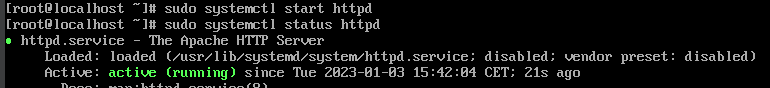
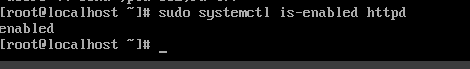
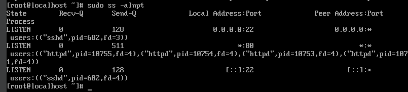
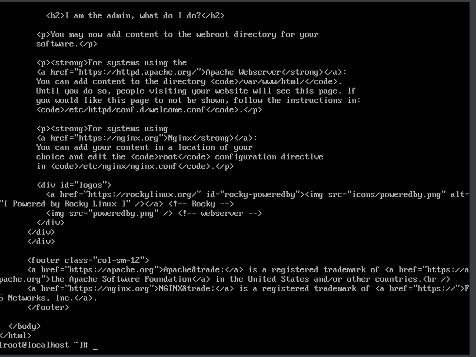

## TP5 : Self-hosted cloud
## Partie 1 : Mise en place et maîtrise du serveur Web

🌞 Installer le serveur Apache
````powershell
[root@localhost ~]# sudo dnf install httpd
````
🌞 Démarrer le service Apache

[root@localhost ~]# sudo systemctl start httpd



.Faites en sorte qu'Apache démarre automatiquement au démarrage de la machine

[root@localhost ~]# sudo systemctl is-enabled httpd


.utiliser une commande ss pour savoir sur quel port tourne actuellement Apache

[root@localhost ~]# sudo ss -alnpt



🌞 TEST
.vérifier qu'il est configuré pour démarrer automatiquement

[root@localhost ~]# sudo systemctl is -enabled httpd 


.vérifier avec une commande: curl localhost que vous joignez votre serveur web localement

[root@localhost ~]# curl localhost 



## 2. Avancer vers la maîtrise du service
🌞 Le service Apache...
```powershell
[root@localhost ~]$ cat /usr/lib/systemd/system/httpd.service

[Unit]
Description=The Apache HTTP Server
Wants=httpd-init.service
After=network.target remote-fs.target nss-lookup.target httpd-init.service
Documentation=man:httpd.service(8)

[Service]
Type=notify
Environment=LANG=C

ExecStart=/usr/sbin/httpd $OPTIONS -DFOREGROUND
ExecReload=/usr/sbin/httpd $OPTIONS -k graceful
# Send SIGWINCH for graceful stop
KillSignal=SIGWINCH
KillMode=mixed
PrivateTmp=true
OOMPolicy=continue

[Install]
WantedBy=multi-user.target
````

🌞 Déterminer sous quel utilisateur tourne le processus Apache
````powershell
[root@localhost conf]$ cat httpd.conf | grep -a  apache

User apache
Group apache
```
[root@localhost conf]$ ps -ef | grep apache

apache       707     687  0 13:21 ?        00:00:00 /usr/sbin/httpd -DFOREGROUND
apache       709     687  0 13:21 ?        00:00:00 /usr/sbin/httpd -DFOREGROUND
apache       759     708  0 13:21 ?        00:00:00 /usr/sbin/httpd -DFOREGROUND
apache       760     708  0 13:21 ?        00:00:00 /usr/sbin/httpd -DFOREGROUND
root       1092   1065 0 13:25 ttyl/0    00:00:00 grep --color=auto apache

[root@localhost share]$ ls -al | grep testpage
drwxr-xr-x.   2 root root    24 Jan  3 15:27 testpag
````
🌞 Changer l'utilisateur utilisé par Apache
````powershell
[root@localhost etc]$ sudo adduser user1 -d /usr/share/httpd -s /sbin/nologin
adduser: warning: the home directory /usr/share/httpd already exists.
adduser: Not copying any file from skel directory into it.
[root@localhost etc]$ cat /etc/passwd | grep user1
user1:x:1002:1002::/usr/share/httpd:/sbin/nologin
[root@localhost conf]$ cat httpd.conf | grep user1
User user1
[root@localhost ~]$ ps -ef | grep httpd
root         687     1  0 13:21 ?        00:00:00 /usr/sbin/httpd -DFOREGROUND
user1        707     687 0 13:21 ?        00:00:00 /usr/sbin/httpd -DFOREGROUND
user1        709    687  0 13:21 ?        00:00:00 /usr/sbin/httpd -DFOREGROUND
user1        710    687  0 13:21 ?        00:00:00 /usr/sbin/httpd -DFOREGROUND
user1        711    687  0 13:21 ?        00:00:00 /usr/sbin/httpd -DFOREGROUND
root     1114   1065  0 13:21 ttyl/0    00:00:00 grep --color=auto httpd
````

````powershell
🌞 Faites en sorte que Apache tourne sur un autre port

[root@localhost conf]$ cat httpd.conf | grep -i listen
Listen 80
[root@localhost ~]$ sudo ss -alntp | grep httpd
LISTEN 0      511                *:80           *:*    users:(("httpd",pid=711,fd=4),("httpd",pid=710,fd=4),("httpd",pid=709,fd=4),("httpd",pid=687,fd=4))
```powershell
[root@localhost conf]$ curl localhost:80 | head -5
  % Total    % Received % Xferd  Average Speed   Time    Time     Time  Current
                                 Dload  Upload   Total   Spent    Left  Speed
<!doctype html>    0    0     0      0      0 --:--:-- --:--:-- --:--:--     0
<html>
  <head>
    <meta charset='utf-8'>
    <meta name='viewport' content='width=device-width, initial-scale=1'>

````

## Partie 2 : Mise en place et maîtrise du serveur de base de données
````powershell
🌞 Install de MariaDB sur db.tp5.linux
[root@localhost ~]$ sudo dnf install mariadb-server
[root@localhost ~]$ sudo mysql_secure_installation

[root@localhost ~]$ sudo systemctl enable mariadb
Created symlink /etc/systemd/system/mysql.service → /usr/lib/systemd/system/mariadb.service.
Created symlink /etc/systemd/system/mysqld.service → /usr/lib/systemd/system/mariadb.service.
Created symlink /etc/systemd/system/multi-user.target.wants/mariadb.service → /usr/lib/systemd/system/mariadb.service.

[root@localhost ~]$ sudo systemctl start mariadb

````
````powershell
🌞 Port utilisé par MariaDB

[root@localhost ~]$ sudo ss -altnp | grep mariadb
LISTEN 0      80                 *:3306            *:*    users:(("mariadbd",pid=3970,fd=19))

[root@localhost ~]$ sudo firewall-cmd --add-port=3306/tcp --permanent
success
````
````powershell
🌞 Processus liés à MariaDB

[root@localhost ~]$ ps -ef | grep mariadb
mysql        3970      1  0 12:52  ?        00:00:00 /usr/libexec/mariadbd --basedir=/usr
root      1110    1077  0 13:09 ttyl/0    00:00:00 grep --color=auto mariadb
````


 ## Partie 3 : Configuration et mise en place de NextCloud

1. Base de données

🌞 Préparation de la base pour NextCloud
````
MariaDB [(none)]> CREATE USER 'nexcloud'@'10.105.1.11' IDENTIFIED BY 'pewpewpew';
Query OK, 0 rows affected (0.018 sec)`
`````
````
MariaDB [(none)]> CREATE DATABASE IF NOT EXISTS nextcloud CHARACTER SET utf8mb4 COLLATE utf8mb4_general_ci;
Query OK, 1 row affected (0.000 sec)
````
````
MariaDB [(none)]> GRANT ALL PRIVILEGES ON nextcloud.* TO 'nextcloud'@'10.105.1.11';
Query OK, 0 rows affected (0.003 sec)`
````
````
MariaDB [(none)]> FLUSH PRIVILEGES;
Query OK, 0 rows affected (0.000 sec)
````


🌞 Exploration de la base de données
````powershell
[oceane@localhost~]$ mysql -u nextcloud -h 10.105.1.12 -p
Enter password:
Welcome to the MySQL monitor.  Commands end with ; or \g.
Your MySQL connection id is 23
````
````powershell
[oceane@localhost ~]$ sudo dnf install mysql-8.0.30-3.el9_0.x86_64
`````
````
mysql> SHOW DATABASES;
+--------------------+
| Database           |
+--------------------+
| information_schema |
| nextcloud          |
+--------------------+
2 rows in set (0.00 sec)
`````
🌞 Trouver une commande SQL qui permet de lister tous les utilisateurs de la base de données
````powershell
mysql> SHOW DATABASES;
+--------------------+
| Database           |
+--------------------+
| information_schema |
| nextcloud          |
+--------------------+
2 rows in set (0.00 sec)


2. Serveur Web et NextCloud

🌞 Install de PHP

````powershell
[oceane@localhost conf]$ sudo dnf config-manager --set-enabled crb

`````powershell
[oceane@localhost conf]$ sudo dnf install dnf-utils http://rpms.remirepo.net/enterprise/remi-release-9.rpm -y`

``````
`````powershell
[oceane@localhost conf]$ dnf module list php
``````
````powershell
[oceane@localhost conf]$ sudo dnf module enable php:remi-8.1 -y
````
````powershell
[oceane@localhost conf]$ sudo dnf install -y php81-php
````


🌞 Install de tous les modules PHP nécessaires pour NextCloud
`````powershell
[oceane@localhsot conf]$ sudo dnf install -y libxml2 openssl php81-php php81-php-ctype php81-php-curl php81-php-gd php81-php-iconv php81-php-json php81-php-libxml php81-php-mbstring php81-php-openssl php81-php-posix php81-php-session php81-php-xml php81-php-zip php81-php-zlib php81-php-pdo php81-php-mysqlnd php81-php-intl php81-php-bcmath php81-php-gmp
````` 


🌞 Récupérer NextCloud
`````powershell
[oceane@localhost ~]$ sudo curl https://download.nextcloud.com/server/prereleases/nextcloud-25.0.0rc3.zip -O
[sudo] password for oceane:
  % Total    % Received % Xferd  Average Speed   Time    Time     Time  Current
                                 Dload  Upload   Total   Spent    Left  Speed
  7  168M    7 13.2M    0     0   708k      0  0:04:03  0:00:19  0:03:44  455k`
  ````
  ````
  [oceane@localhost ~]$ ls /var/www/tp5_nextcloud/
  
3rdparty  config       core      index.html  occ           ocs-provider  resources   themes
apps      console.php  cron.php  index.php   ocm-provider  public.php    robots.txt  updater
AUTHORS   COPYING      dist      lib         ocs           remote.php    status.php  version.php
`````
````powershell 
[oceane@localhost ~]$ sudo chown apache:apache /var/www/tp5_nextcloud/ -R
````

🌞 Adapter la configuration d'Apache
````powershell 
[oceane@localhost conf]$ sudo cat httpd.conf | tail -n 18
IncludeOptional conf.d/*.conf

<VirtualHost *:80>
  # on indique le chemin de notre webroot
  DocumentRoot /var/www/tp5_nextcloud/
  # on précise le nom que saisissent les clients pour accéder au service
  ServerName  web.tp5.linux

  # on définit des règles d'accès sur notre webroot
  <Directory /var/www/tp5_nextcloud/>
    Require all granted
    AllowOverride All
    Options FollowSymLinks MultiViews
    <IfModule mod_dav.c>
      Dav off
    </IfModule>
  </Directory>
</VirtualHost>
````

🌞 Redémarrer le service Apache pour qu'il prenne en compte le nouveau fichier de conf
````powershell
[oceane@localhost conf]$ sudo systemctl restart httpd
````
3. Finaliser l'installation de NextCloud

🌞 Exploration de la base de données`
````powershell
mysql> SELECT Count(*) FROM INFORMATION_SCHEMA.TABLES WHERE TABLE_TYPE = 'BASE TABLE';
+----------+
| Count(*) |
+----------+
|       95 |
+----------+
1 row in set (0.00 sec)
`````


